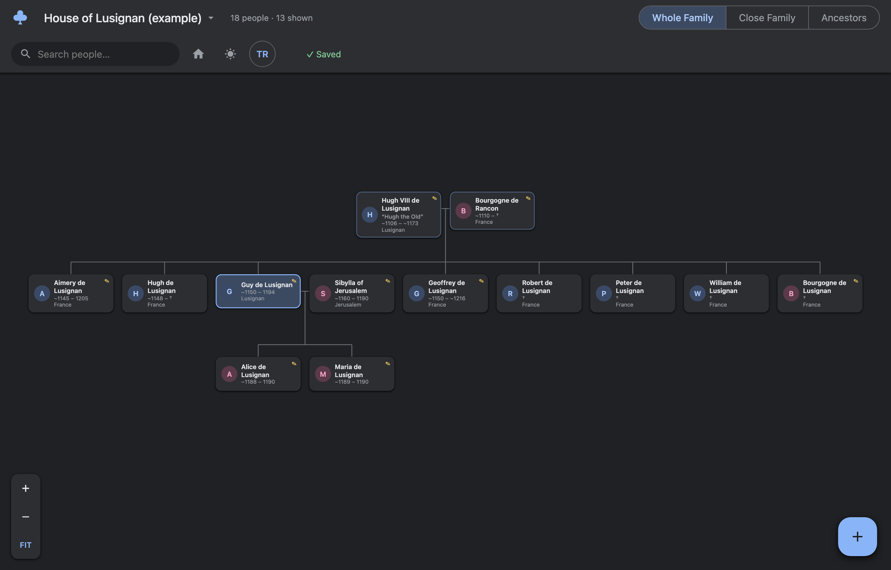

# 🌳 Famaile Tree

**An offline, private family-tree browser & editor that runs in your own browser.**
Create, load and manage as many family trees as you like — record people, dates,
places, relationships and interview notes. No account, no cloud, no tracking.
**Your data never leaves your machine.**

> Built for sitting down with relatives and slowly mapping out a family: click a
> person, ask questions, type what you learn, and everything saves automatically
> to a plain JSON file on your computer.

<p align="center"></p>


---

## Why Famaile Tree?

- **Private by design.** A tiny local server serves the app to `localhost` only and
  reads/writes JSON files on your disk. Nothing is ever uploaded. A strict
  Content-Security-Policy blocks the page from making any network request.
- **Offline.** No internet required — ever. No external fonts, scripts or CDNs.
- **Zero runtime dependencies.** Just Node.js and plain HTML/CSS/JS. Easy to audit.
- **Yours forever.** Trees are human-readable JSON you fully own; export any time.
- **Built for real interviews.** Per-person notes, approximate dates, uncertain
  flags, multiple marriages, maiden names, causes of death, and more.

## Use it in your browser (no install)

Prefer not to install anything? A free, hosted build runs entirely in your browser:

**→ https://metemorris.github.io/famaile-tree/**

There is still **no account, no cloud and no upload** — the page is just the app, and
your trees are saved **on your own machine**:

- **Chromium browsers (Chrome, Edge, Brave, …):** click **Open a folder** in the tree
  menu and the app reads and writes real `.json` files in the folder you pick — just
  like the local app, including automatic `.backups/` and a `.trash/` folder. Point it
  at a synced folder (Dropbox, iCloud Drive, …) and your trees follow you between machines.
- **Other browsers (Safari, Firefox), or before you pick a folder:** trees are kept in
  your browser's own local database. They persist across reloads on that browser; use
  **Export JSON** to back them up or carry them elsewhere.

After it loads, the hosted app makes **no network requests** (a strict
Content-Security-Policy allows same-origin only), so you can even go offline and keep working.

For real files and automatic backups in **every** browser, install the local app below.

## Install & run

You need [Node.js](https://nodejs.org) 18 or newer.

### Fastest — run without installing

```bash
npx famaile-tree
```

This downloads and starts the app, then opens it in your browser at
`http://localhost:3456`. (Before it's published to npm you can run it straight from
the repo: `npx github:metemorris/famaile-tree`.)

### Install globally

```bash
npm install -g famaile-tree
famaile-tree
```

### Homebrew (macOS / Linux)

```bash
brew install metemorris/tap/famaile-tree
famaile-tree
```

### From source

```bash
git clone https://github.com/metemorris/famaile-tree.git
cd famaile-tree
npm start
```

Stop the app any time with `Ctrl+C`.

## Usage

The app opens with an example tree (the immediate relatives of **Guy de Lusignan**,
12th-century King of Jerusalem) so you can explore right away.

- **Your trees** — use the tree menu in the header to **create**, **open**,
  **rename**, **duplicate**, **delete**, **import** (a `.json` file) or **export**
  the current tree.
- **Data folder** — the bottom of the tree menu shows where your trees are saved
  and lets you change it (for example to your Desktop or a synced folder). You can
  either point the app at an existing folder of trees or tick *Move my current
  trees* to take them with you. Your choice is remembered the next time you launch.
- **Click** a person to open the side panel and edit name, sex, birth/death/burial,
  occupation, and notes.
- **Double-click** a person to re-root ("focus") the tree on them.
- **Add relatives** with the `+` buttons in the panel (father / mother / spouse /
  child / sibling). While typing a name you can link an existing person instead of
  creating a duplicate.
- **Views:** *Whole Family*, *Close Family*, *Ancestors* (segmented control, top).
- **Search** anyone (top-left), including people not connected to the current view.
- **Dark mode** and **EN / TR** language toggle in the header.
- Drag to pan, scroll / pinch to zoom, **Fit** to frame the whole tree.

### Command-line options

```
famaile-tree [options]

  -p, --port <n>     Port to listen on            (default 3456)
  -d, --data <dir>   Folder to store your trees   (default ~/.famaile-tree/trees)
      --host <addr>  Address to bind              (default 127.0.0.1)
      --no-open      Don't open the browser automatically
  -h, --help         Show help
  -v, --version      Show version
```

You can also set the data folder with the `FAMAILE_TREE_DATA` environment variable.

### Where your trees are saved

By default trees live in `~/.famaile-tree/trees`. There are three ways to change
that, in order of priority:

1. **`--data <dir>` or `FAMAILE_TREE_DATA`** — pins the folder for that run only.
2. **In the app** — the tree menu has a **Data folder** row showing the current
   path with an option to switch to any folder (e.g. `~/Desktop/family-trees`).
   The folder is created if it doesn't exist, and you can move your existing trees
   into it. This choice is remembered in `~/.famaile-tree/config.json` and used on
   the next launch.
3. **The default** — `~/.famaile-tree/trees` when nothing above is set.

A `--data` flag or `FAMAILE_TREE_DATA` always wins over the remembered choice and,
while active, the in-app picker is disabled so the session stays where you pointed it.

## Your data & privacy

- Trees are stored as individual JSON files in your data folder (by default
  `~/.famaile-tree/trees`). Each save first copies the previous version into a
  `.backups/` folder (the newest copies are kept) so you can recover from mistakes.
- The server binds to `127.0.0.1` and rejects requests with a non-local `Host`
  header, so other devices on your network cannot reach it.
- Nothing is sent anywhere. This is a local tool; treat your data folder like any
  other personal documents and back it up yourself if it matters to you.

## Tree file format

A tree is a JSON object with a `people` array. Each person has a stable `id` plus
optional fields:

```jsonc
{
  "summary": { "name": "My Family", "root": "p1" },
  "people": [
    {
      "id": "p1",
      "name": "Ada Lovelace",
      "sex": "F",
      "birth_date": "1815.12.10",      // YYYY | YYYY.MM | YYYY.MM.DD
      "birth_place": "London",
      "birth_country": "England",
      "occupation": "Mathematician",
      "deceased": true,
      "death_date": "1852.11.27",
      "notes": "Notes from the interview…",
      "father_id": "p2",
      "mother_id": "p3",
      "spouse_ids": ["p4"],
      "children_ids": ["p5"]
    }
  ]
}
```

Relationships are stored by `id` (names can repeat in a family, so ids keep links
unambiguous); human-readable name fields are written alongside for portability.
Dates support an *approximate* flag (`birth_date_uncertain`, …). See
[`examples/lusignan.json`](examples/lusignan.json) for a complete example.

## Development

```bash
npm start          # run the app from source
npm test           # run the test suite (Node's built-in test runner)
npm run test:watch # re-run tests on change
```

The core logic is split into small, dependency-free, unit-tested modules:

- `public/lib/model.js` — parsing, migration, date/place normalization, serialization
- `public/lib/layout.js` — the genealogy layout algorithm
- `public/lib/treeStore.js` — shared, pure store helpers (id rules, slugging, tree shape)
- `public/lib/storage.js` — picks a storage backend for the environment, with three behind it:
  `serverStore.js` (local API), `fsStore.js` (File System Access folder) and `idbStore.js` (IndexedDB)
- `src/store.js` — safe tree file storage with backups (Node)
- `src/server.js` — the local HTTP server and JSON API

See [CONTRIBUTING.md](CONTRIBUTING.md).

### Hosting the browser app

`.github/workflows/pages.yml` publishes the static app to GitHub Pages on every push to
`main`. It assembles `_site` from `public/` plus the bundled `examples/lusignan.json` and
nothing else — your `trees/` folder is gitignored and never part of the build, so no private
data can ship. The same `public/` is served by the local Node server, so there is one codebase:
it detects `/api/trees` to use the server, and falls back to browser storage when hosted statically.

## License

[MIT](LICENSE) © Mete Morris
